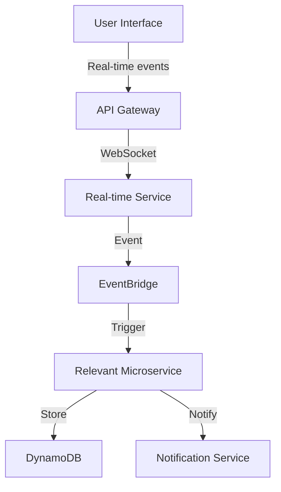
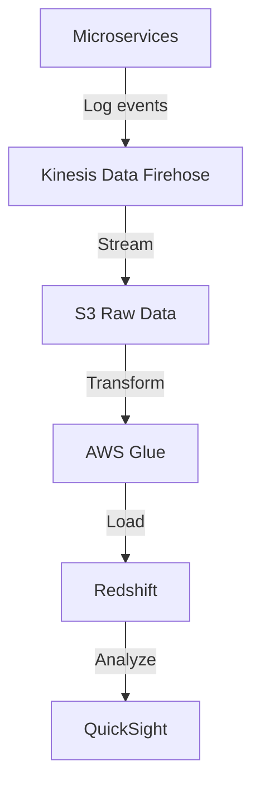

# Technical Requirements Document
## Mental Health Application Platform

### 1. System Architecture Overview

#### 1.1 High-Level Architecture
- **Frontend Layer**
  - Web Application: React.js with TypeScript
  - Mobile Application: Flutter for cross-platform deployment
  - Progressive Web App (PWA) capabilities for offline support

- **API Gateway Layer**
  - AWS API Gateway for REST endpoints
  - WebSocket API for real-time features
  - GraphQL API for flexible data querying

- **Microservices Layer**
  - Independently deployable services using AWS Lambda
  - Event-driven architecture using AWS EventBridge
  - Container-based services using ECS/Fargate for long-running processes

- **Data Layer**
  - Amazon DynamoDB for user data and real-time features
  - Amazon RDS (PostgreSQL) for structured data
  - Amazon OpenSearch for full-text search and analytics
  - Amazon S3 for media storage

#### 1.2 Core Microservices

1. **User Management Service**
   - Authentication/Authorization (AWS Cognito)
   - User profile management
   - Subscription management
   - Technologies: Python, AWS Lambda, DynamoDB
   - APIs:
     - `/auth/*` - Authentication endpoints
     - `/users/*` - User management endpoints
     - `/subscriptions/*` - Subscription management

2. **AI Coaching Service**
   - Real-time conversation processing
   - Context management
   - Personalization engine
   - Technologies: Python, AWS SageMaker, Lambda
   - APIs:
     - `/coach/conversation` - Real-time coaching
     - `/coach/insights` - Personalized insights
     - `/coach/history` - Conversation history

3. **Mood Analysis Service**
   - Voice analysis (Amazon Transcribe)
   - Text sentiment analysis (Amazon Comprehend)
   - Facial expression analysis (Amazon Rekognition)
   - Technologies: Python, AWS AI Services, Lambda
   - APIs:
     - `/mood/analyze` - Multi-modal mood analysis
     - `/mood/track` - Mood tracking
     - `/mood/trends` - Trend analysis

4. **VR/AR Therapy Service**
   - Session management
   - Content delivery
   - Progress tracking
   - Technologies: Unity integration, AWS Lambda
   - APIs:
     - `/vr/sessions/*` - Session management
     - `/vr/content/*` - Content delivery
     - `/vr/progress/*` - Progress tracking

5. **CBT Journey Service**
   - Module management
   - Progress tracking
   - Dynamic content generation
   - Technologies: Python, AWS Lambda
   - APIs:
     - `/cbt/modules/*` - Module management
     - `/cbt/progress/*` - Progress tracking
     - `/cbt/recommendations/*` - Personalized recommendations

6. **Crisis Detection Service**
   - Real-time monitoring
   - Alert management
   - Intervention coordination
   - Technologies: Python, AWS Lambda, EventBridge
   - APIs:
     - `/crisis/monitor` - Real-time monitoring
     - `/crisis/alerts` - Alert management
     - `/crisis/intervention` - Intervention coordination

7. **Community Service**
   - Group management
   - Real-time chat (WebSocket)
   - Content moderation
   - Technologies: Python, AWS Lambda, WebSocket API
   - APIs:
     - `/community/groups/*` - Group management
     - `/community/chat` - Real-time chat
     - `/community/moderation/*` - Content moderation

8. **Journal Service**
   - Entry management
   - Sentiment analysis
   - Progress visualization
   - Technologies: Python, AWS Lambda, Comprehend
   - APIs:
     - `/journal/entries/*` - Entry management
     - `/journal/analysis/*` - Sentiment analysis
     - `/journal/insights/*` - Progress insights

9. **Biorhythm Service**
   - Wearable data integration
   - Pattern analysis
   - Recommendation engine
   - Technologies: Python, AWS Lambda
   - APIs:
     - `/biorhythm/data/*` - Data collection
     - `/biorhythm/analysis/*` - Pattern analysis
     - `/biorhythm/recommendations/*` - Health recommendations

### 2. Data Flow Architecture

#### 2.1 Real-time Data Flow

#### 2.2 Analytics Data Flow

### 3. Security Architecture

#### 3.1 Authentication & Authorization
- AWS Cognito for user authentication
- JWT-based API authorization
- Role-based access control (RBAC)
- OAuth2.0 integration for third-party services

#### 3.2 Data Security
- End-to-end encryption for sensitive data
- HIPAA-compliant data storage
- Data encryption at rest and in transit
- Regular security audits and penetration testing

#### 3.3 Compliance
- HIPAA compliance implementation
- GDPR requirements implementation
- Regular compliance audits
- Data retention policies

### 4. Deployment Architecture

#### 4.1 CI/CD Pipeline
- GitHub Actions for CI/CD
- Automated testing
- Infrastructure as Code using AWS CDK
- Blue-green deployment strategy

#### 4.2 Monitoring & Observability
- AWS CloudWatch for logging and monitoring
- X-Ray for distributed tracing
- Custom metrics and dashboards
- Automated alerting system

#### 4.3 Scaling Strategy
- Auto-scaling for serverless functions
- DynamoDB on-demand scaling
- RDS read replicas for database scaling
- CloudFront for content delivery

### 5. Development Requirements

#### 5.1 Development Environment
- Docker for local development
- LocalStack for AWS service emulation
- Git workflow with feature branching
- Automated code quality checks

#### 5.2 Testing Strategy
- Unit testing with pytest
- Integration testing
- End-to-end testing
- Performance testing
- Security testing

#### 5.3 Documentation
- OpenAPI/Swagger for API documentation
- Architecture decision records (ADRs)
- Runbooks for operations
- User documentation

### 6. Infrastructure Requirements

#### 6.1 AWS Services
- AWS Lambda for serverless computing
- Amazon ECS/Fargate for containerized services
- Amazon S3 for storage
- Amazon CloudFront for CDN
- Amazon RDS for relational database
- Amazon DynamoDB for NoSQL database
- Amazon ElastiCache for caching
- Amazon SQS/SNS for messaging
- Amazon Cognito for authentication
- AWS WAF for security

#### 6.2 Third-party Services
- Stripe for payment processing
- SendGrid for email notifications
- Twilio for SMS notifications
- Unity for VR/AR integration
- Firebase for mobile push notifications

### 7. Mobile Application Requirements

#### 7.1 Flutter Implementation
- Cross-platform compatibility
- Offline capability
- Push notification integration
- Biometric authentication
- Camera and sensor access
- Background processing

### 8. Performance Requirements

#### 8.1 Response Times
- API response time < 200ms
- Real-time features latency < 100ms
- Page load time < 2s
- Mobile app startup time < 3s

#### 8.2 Availability
- 99.99% uptime for critical services
- Fault tolerance implementation
- Disaster recovery plan
- Regular backup strategy

### 9. Scalability Requirements

#### 9.1 Load Handling
- Support for 5M active users
- Handle 10,000 concurrent users
- Process 1000 requests/second
- Support 100TB of user data

#### 9.2 Growth Strategy
- Horizontal scaling capability
- Regional expansion support
- Multi-region deployment
- Data migration strategy
